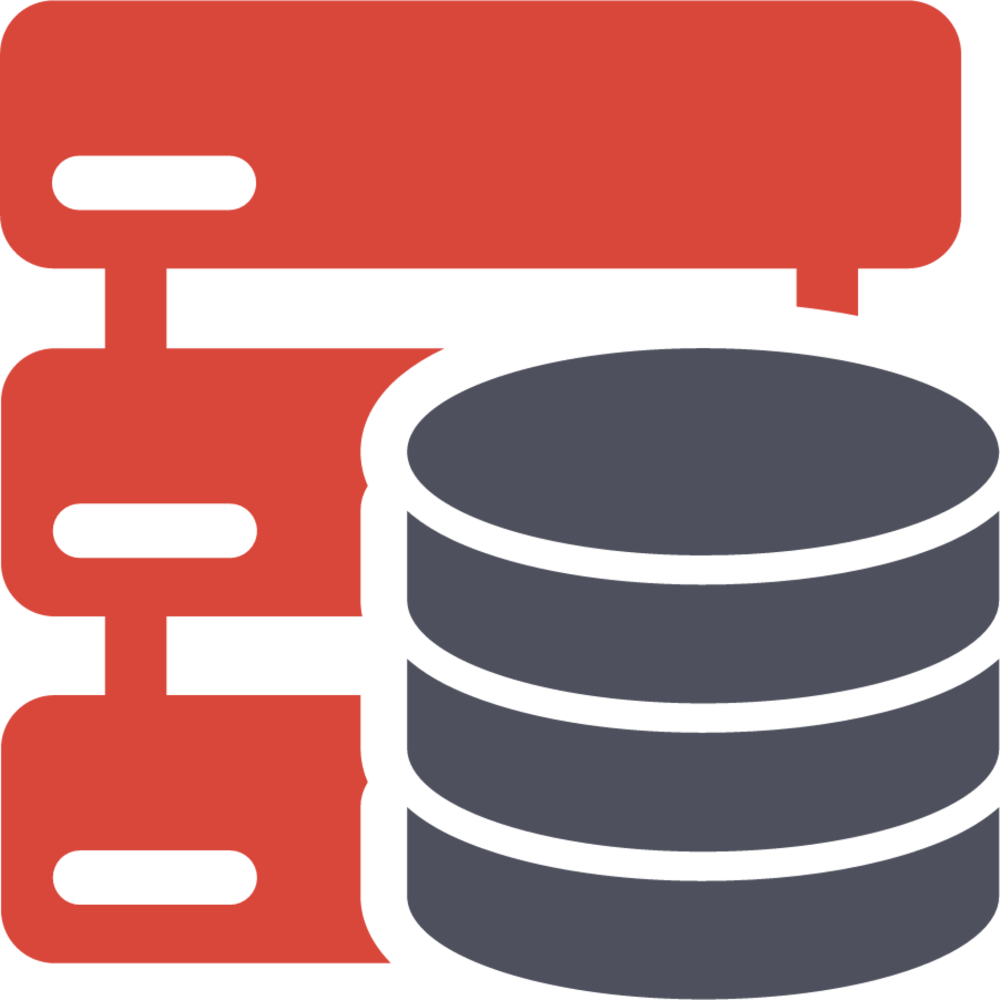
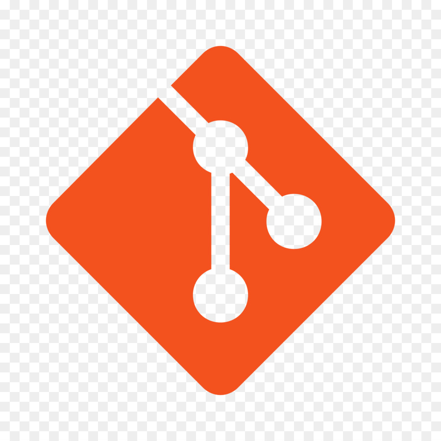
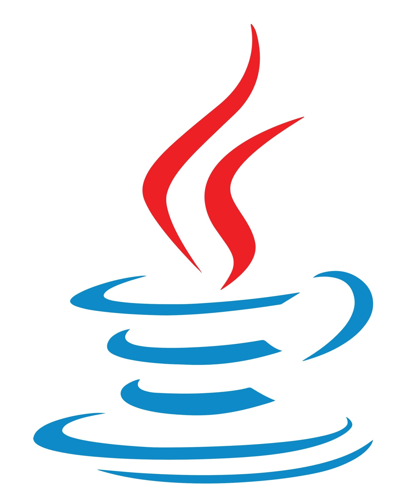

<!--### Hi there 👋-->

  

<b>to my personal GitHub profile!</b>

  

    🦴🦴🦴🦴🦴🦴🦴🦴🦴🦴🦴🦴🦴🦴🦴🦴🦴🦴🦴🦴🦴🦴🦴🦴🦴🦴🦴🦴🦴🦴🦴  
  <b> 🦴 I am a software developer with a huge passion for continuous learning and STEM topics.🦴</b>  
  <b> 🦴‎ ‎ My current interests include data science and applying machine learning algorithms to‎ ‎ ‎🦴</b>  
  <b>‎ 🦴‎ ‎ ‎ ‎ solve complex problems using real-world data. On my free time I like developing my‎ ‎ ‎ ‎‎🦴 </b>   
  <b> 🦴‎ ‎ ‎ ‎ ‎ ‎ ‎ ‎ ‎ problem-solving skills, building unique projects, and having people test them.‎ ‎ ‎ ‎ ‎ ‎ ‎ ‎ ‎ ‎🦴</b>
    🦴🦴🦴🦴🦴🦴🦴🦴🦴🦴🦴🦴🦴🦴🦴🦴🦴🦴🦴🦴🦴🦴🦴🦴🦴🦴🦴🦴🦴🦴🦴  

 
    <b> My Socials (WOOOO!): </b>  

<h4 align="center">
  🦴🦴🦴🦴🦴🦴🦴🦴🦴🦴🦴🦴🦴🦴🦴🦴🦴🦴🦴🦴🦴🦴🦴🦴🦴🦴🦴🦴🦴🦴   🦴
  <code><a href="https://www.linkedin.com/in/ernie-sumoso" title="LinkedIn"> LinkedIn </a></code> 
  <code><a href="https://www.instagram.com/ernieluds1403/" title="Instagram"> Instagram </a></code>
  <code><a href="https://www.credly.com/users/ernie.ai" title="Credly"> Credly </a></code>
  <code><a href="https://leetcode.com/u/ErnieFlakes/" title="LeetCode"> LeetCode </a></code>
  <code><a href="https://www.hackerrank.com/profile/a20161018" title="HackerRank"> HackerRank </a></code>
  🦴   🦴🦴🦴🦴🦴🦴🦴🦴🦴🦴🦴🦴🦴🦴🦴🦴🦴🦴🦴🦴🦴🦴🦴🦴🦴🦴🦴🦴🦴🦴  
</h4>

 
    <b> I have worked with (So far) </b>  

<h5 align="center">
  🦴🦴🦴🦴🦴🦴🦴🦴🦴🦴🦴🦴🦴🦴🦴🦴🦴🦴🦴🦴🦴🦴🦴🦴🦴🦴🦴🦴🦴🦴🦴🦴🦴🦴🦴🦴🦴   🦴
   <code> <b> ‎‎‎Python </b> </code>  | 
   <code> <b> ‎ SQL‎  </b> </code>  | 
   <code> <b> ‎ Git‎  </b> </code>  | 
   <code> <b> ‎ AWS‎  </b> </code>  | 
   <code> <b> Azure ‎‎</b> </code> 
  🦴   🦴
   <code> <b> ‎‎ Java </b> </code>  | 
   <code> <b> MongoDB </b> </code>  | 
   <code> <b> C# </b> </code>  | 
   <code> <b> JavaScript </b> </code> | 
   <code> <b> Unity  ‎‎</b> </code>
  🦴   🦴🦴🦴🦴🦴🦴🦴🦴🦴🦴🦴🦴🦴🦴🦴🦴🦴🦴🦴🦴🦴🦴🦴🦴🦴🦴🦴🦴🦴🦴🦴🦴🦴🦴🦴🦴🦴  
</h5>

  
<b> 🛠️ My Projects </b>  

<!--
**ErnieSumoso/ErnieSumoso** is a ✨ _special_ ✨ repository because its `README.md` (this file) appears on your GitHub profile.

Here are some ideas to get you started:

- 🔭 I’m currently working on ...
- 🌱 I’m currently learning ...
- 👯 I’m looking to collaborate on ...
- 🤔 I’m looking for help with ...
- 💬 Ask me about ...
- 📫 How to reach me: ...
- 😄 Pronouns: ...
- ⚡ Fun fact: ...
-->
