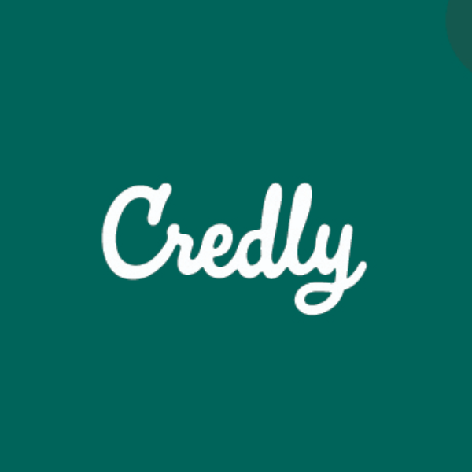

<!--### Hi there 👋-->

  

<b>to my personal GitHub profile!</b>

  

  
 🦴🦴🦴🦴🦴🦴🦴🦴🦴🦴🦴🦴🦴🦴🦴🦴🦴🦴🦴🦴🦴🦴🦴🦴🦴🦴🦴🦴🦴🦴🦴  
<b> 🦴 I am a software developer with a huge passion for continuous learning and STEM topics.🦴</b>  
<b> 🦴††My current interests include data science and applying machine learning algorithms to††â€ğŸ¦´</b>  
<b>†🦴††††solve complex problems using real-world data. On my free time I like developing my†††â€â€ğŸ¦´ </b>   
<b> 🦴†††††††††problem-solving skills, building unique projects, and having people test them.†††††††††â€ğŸ¦´</b>  <!-- invisible char -->
  🦴🦴🦴🦴🦴🦴🦴🦴🦴🦴🦴🦴🦴🦴🦴🦴🦴🦴🦴🦴🦴🦴🦴🦴🦴🦴🦴🦴🦴🦴🦴  

  
<b> My Socials (WOOOO!): </b>  
<h5 align="center">
  <code><a href="https://www.linkedin.com/in/ernie-sumoso" title="LinkedIn"> LinkedIn</a></code>
  <code><a href="https://www.hackerrank.com/profile/a20161018" title="HackerRank"> HackerRank</a></code>
  <code><a href="https://leetcode.com/u/ErnieFlakes/" title="LeetCode"> LeetCode</a></code>
  <code><a href="https://www.instagram.com/ernieluds1403/" title="Instagram"> Instagram</a></code>
  <code><a href="https://www.credly.com/users/ernie.ai" title="Credly"> Credly </a></code>
</h5>

  
<b> I have worked with (So far): </b>  
 <b> Python  | </b>
 <b> Java  | </b>
 <b> Git  | </b>
 <b> JavaScript  | </b>

  
<b> 🛠️ My Projects </b>  

<!--
**ErnieSumoso/ErnieSumoso** is a ✨ _special_ ✨ repository because its `README.md` (this file) appears on your GitHub profile.

Here are some ideas to get you started:

- 🔭 I’m currently working on ...
- 🌱 I’m currently learning ...
- 👯 I’m looking to collaborate on ...
- 🤔 I’m looking for help with ...
- 💬 Ask me about ...
- 📫 How to reach me: ...
- 😄 Pronouns: ...
- ⚡ Fun fact: ...
-->
